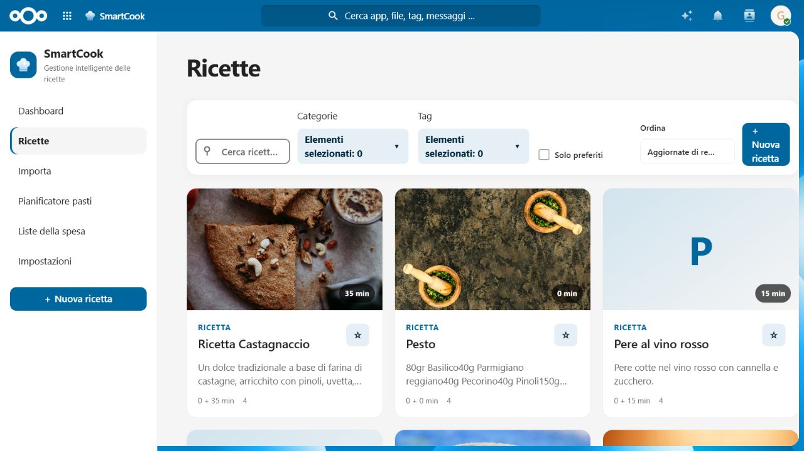
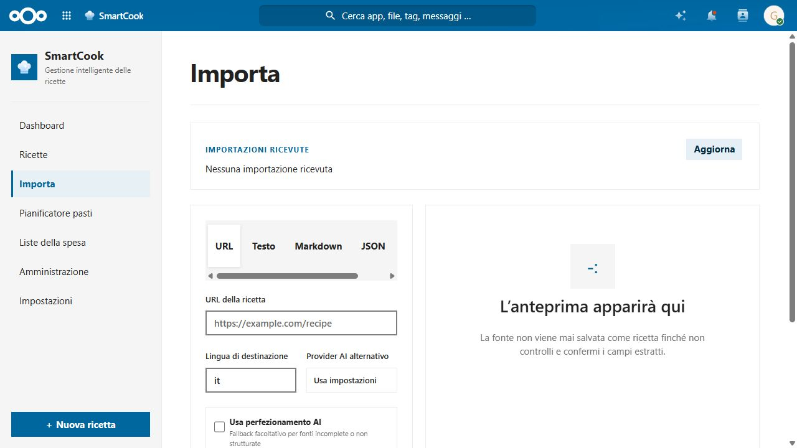
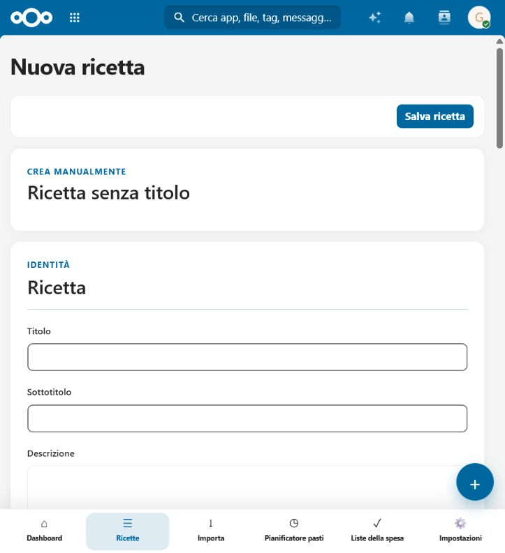
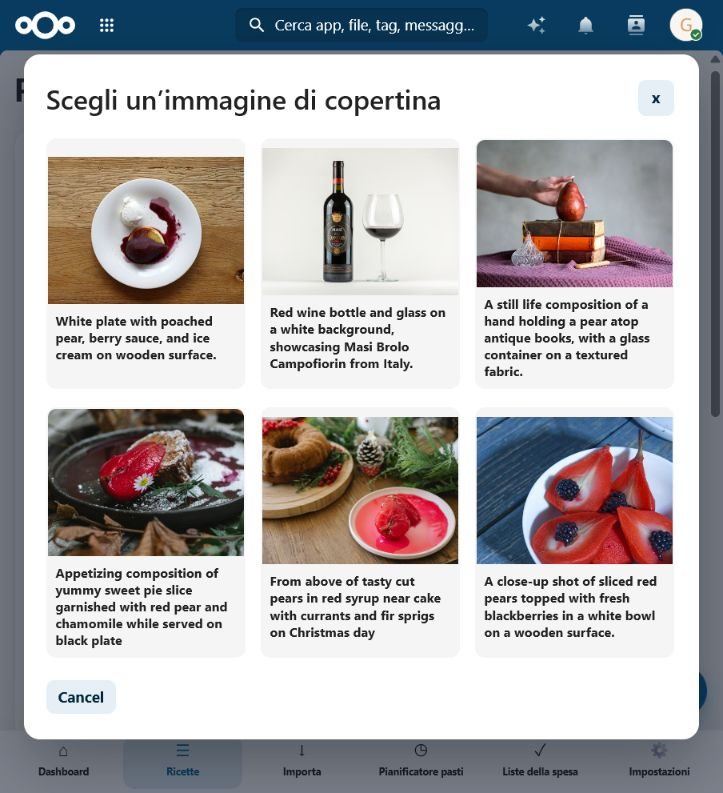

# SmartCook 🍳

> [!WARNING]
> **Vibe-coded project.** SmartCook is built through a fast, AI-assisted and experimentation-driven workflow. It is actively evolving: please review changes carefully and avoid using it as the only copy of important data until you have tested it in your own Nextcloud environment.

**SmartCook** turns your Nextcloud into a private home for recipes, meal planning and shopping lists. Keep your cooking knowledge self-hosted, organised and available alongside the files and people you already use in Nextcloud.

## ✨ What you can do

| | |
| --- | --- |
| 📚 **Build your recipe library** | Create structured recipes with ingredients, steps, photos, tags, categories, tools and nutritional details. |
| 🔎 **Import recipes intelligently** | Start from a URL, pasted text, HTML, Markdown, JSON or a file; SmartCook extracts what it can and always lets you review the result. |
| 🧠 **Use AI only when you want** | Configure an optional provider for extraction, normalisation, translations and suggestions. The app remains useful without AI. |
| 🗓️ **Plan meals** | Organise breakfast, lunch, dinner and snacks in a weekly or monthly planner. |
| 🛒 **Create smarter shopping lists** | Aggregate ingredients from several recipes, group them by category and tick them off as you shop. |
| 🔐 **Keep control of your data** | SmartCook is a self-hosted Nextcloud app: your recipes stay in your own instance. |

## 🧭 Highlights

- 🌍 English and Italian interface
- ➗ Quantities, units, fractions and serving-size recalculation
- 🏷️ Categories, coloured tags, favourites and flexible filters
- ⏱️ Preparation, resting and cooking times, temperatures and kitchen tools
- 📎 Attachments, recipe photos and public sharing options
- 📥 Schema.org recipe import with deterministic parsing before optional AI fallback
- 🔍 Search by title, ingredients, tags, time, allergens, cuisine, calories and more
- 📤 Exports for JSON, JSON-LD, Markdown, HTML and printable recipes

## 📸 See it in action

### Keep a beautiful, searchable recipe collection

Browse your collection through visual recipe cards, then narrow it down with full-text search, category and tag filters, favourites, and sorting controls.

### Import recipes from almost anywhere

SmartCook gives you one focused import flow for recipe URLs, plain text, Markdown, JSON and files with OCR support. You can review the extracted data before it becomes part of your library.

### Create structured recipes at your own pace

Use the guided editor to capture a recipe’s identity, timing, ingredients, preparation steps and organisation details.

### Find a cover when a recipe needs one

For recipes without a cover, SmartCook can surface image candidates so you can choose the right visual before saving it to your library.

## 🚀 Getting started

SmartCook is designed as a standard Nextcloud app.

1. Download a SmartCook release compatible with your Nextcloud version.
2. Extract the `smartcook` folder into your instance's `custom_apps` directory.
3. Enable **SmartCook** from **Apps** in Nextcloud.
4. Open **SmartCook** from the main navigation and add your first recipe.

> [!TIP]
> Before upgrading a production installation, back up your database, configuration and existing SmartCook app directory.

## 🤖 Optional AI

AI is entirely optional. When enabled, it can help with importing and refining recipe data; when disabled, SmartCook uses its deterministic import and parsing pipeline instead.

Configure your provider from the app settings. Keep provider credentials private and use an endpoint you trust.

## 🧪 Project status

SmartCook is under active development. Expect frequent improvements, and please report reproducible issues with the Nextcloud version, PHP version, steps to reproduce and relevant error details.

- 🐛 [Report an issue](https://github.com/gabryk91/smartcook/issues)
- 💡 [Browse the source code](https://github.com/gabryk91/smartcook)

## 🤝 Contributing

Contributions, testing reports and recipe-import edge cases are welcome. Please open an issue before proposing a large change so the direction can be discussed first.

## 📄 License

SmartCook is released under the [MIT](LICENSE) license.
