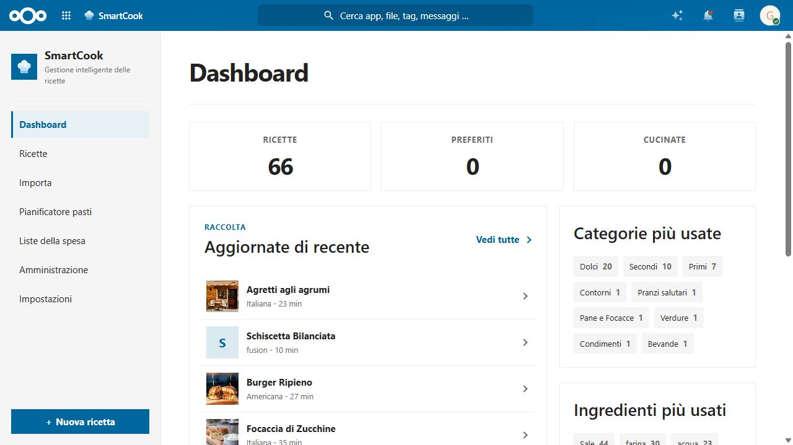
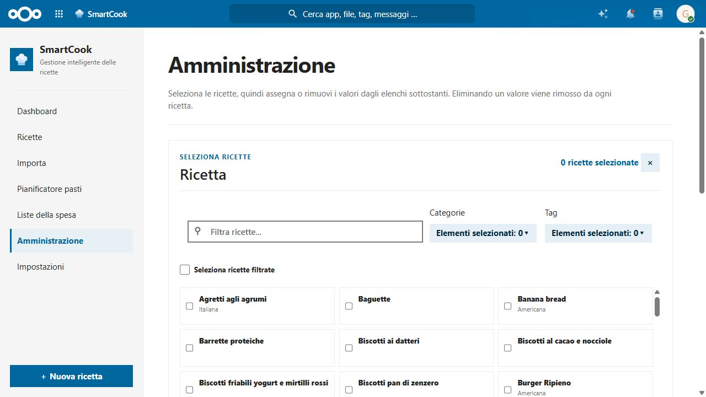
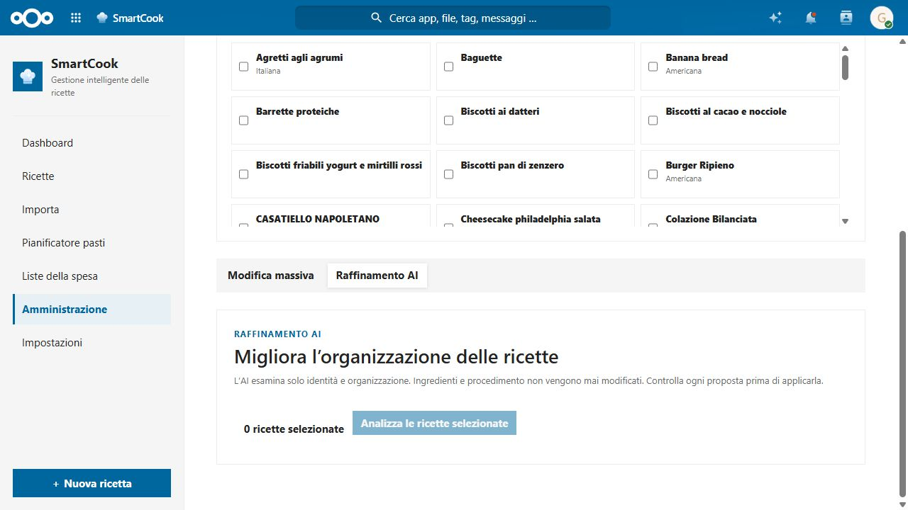

# SmartCook 🍳

[🇬🇧 English](README.md) · [🇮🇹 Italiano](README.it.md)

> [!WARNING]
> **Vibe-coded project.** SmartCook is built through a fast, AI-assisted and experimentation-driven workflow. It is actively evolving: please review changes carefully and avoid using it as the only copy of important data until you have tested it in your own Nextcloud environment.

**SmartCook** is a private, self-hosted cookbook for Nextcloud. It brings together recipe capture, rich organisation, AI-assisted improvements, meal planning and shopping lists—while recipes and settings remain in your own Nextcloud instance.

## ✨ What’s new

- **Import recipes from YouTube, Facebook and Instagram.** Paste a YouTube URL to extract its video title and description, or a public Facebook or Instagram post/Reel URL to extract its public caption. SmartCook turns the available recipe text into a structured, reviewable draft before saving.
- **Mass editing built for real collections.** Filter and select recipes, then assign or remove tags, categories, tools, cuisines, meal types, cooking methods and seasons in a focused administration workspace.
- **Mass AI refinement with control at every step.** Analyse a selected set of recipes, inspect each proposed change field by field, deselect anything you do not want, then apply only the approved improvements. Ingredients and preparation steps are never altered by this workflow.
- **Ingredient alternatives.** Record substitutions directly beside the original ingredient, including their quantity, unit and notes, and keep them visible in recipe previews and public shares.
- **A renewed interface.** The collection, import, administration and recipe-editor workflows have been refined for clearer navigation and more comfortable work with large recipe libraries.

## 🚀 Core capabilities

| | |
| --- | --- |
| 📚 **Structured recipe library** | Create and browse recipes with ingredients, alternatives, steps, photos, tags, categories, tools, nutrition and timing. |
| 📥 **Import from almost anywhere** | Import from ordinary recipe URLs, **YouTube videos**, **public Facebook and Instagram posts and Reels**, pasted text, HTML, Markdown, JSON and files. Review every extracted field before saving. |
| 🧠 **Optional AI assistance** | Use a compatible provider to improve extraction, generate meal plans and refine existing recipes in bulk with reviewable proposals. SmartCook remains fully useful without AI. |
| 🏷️ **Powerful organisation** | Filter, search, favourite and sort recipes; manage taxonomy values and make targeted mass assignments across the collection. |
| 🗓️ **Meal planning** | Schedule breakfast, lunch, dinner and snacks on weekly or monthly plans, with optional AI suggestions. |
| 🛒 **Shopping lists** | Aggregate ingredients from multiple recipes, organise them by category and check items off as you shop. |
| 🔐 **Your data, your server** | SmartCook is a self-hosted Nextcloud app. Recipes, attachments and configuration stay under your control. |

## 🔎 Import recipes from the web, social video and posts

SmartCook’s import workflow is designed to preserve your control: it extracts a draft, shows a complete preview, and saves nothing until you confirm.

- **YouTube:** supports `youtube.com`, `www.youtube.com` and `youtu.be` links. SmartCook reads the publicly available title and video description. Top comments can be used when a YouTube Data API key is configured.
- **Facebook:** supports public `facebook.com` posts, Reels and `fb.watch` links. SmartCook reads the publicly exposed post or Reel description; private or restricted content cannot be imported.
- **Instagram:** supports public `instagram.com` posts and Reels. SmartCook reads the publicly exposed caption and cover image; private, age-restricted or login-required content cannot be imported.
- **Other sources:** Schema.org recipe pages, standard webpages, text, HTML, Markdown, JSON and supported documents are handled through deterministic parsers, with optional AI refinement for incomplete or unstructured sources.

For every URL, SmartCook creates an editable preview before a recipe enters your library. It imports only information exposed by the public page: it does not download social videos, read private posts, or access comments.


## 📸 See it in action

### Your collection at a glance



The dashboard shows collection totals, recently updated recipes and the ingredients, categories and tags you use most.

### Organise many recipes in one place



Select a filtered group of recipes and apply targeted taxonomy changes without touching the rest of your collection.

### Let AI propose improvements—then keep the final word



AI refinement works across selected recipes while keeping ingredients and procedure intact. Every proposed identity or organisation change is visible and individually selectable before it is applied.

### Capture every useful cooking detail


The guided editor covers identity, timing, ingredients with alternatives, preparation steps and organisation metadata.

## 🧭 More highlights

- English and Italian interface
- Quantity, unit, fraction and serving-size recalculation
- Preparation, resting and cooking times, temperatures and kitchen tools
- Attachments, recipe photos, public sharing links and revision history
- Search by title, ingredients, tags, time, allergens, cuisine, calories and more
- Duplicate detection and guided merge
- Cover-image suggestions and selection
- Exports in JSON-LD, Markdown and printable HTML
- Nextcloud unified search, notifications, queued imports and cleanup jobs

## 🤖 Optional AI

AI is opt-in and configurable per user. SmartCook supports Nextcloud Assistant, OpenAI-compatible providers (including OpenAI, OpenRouter, Ollama, LocalAI and Mistral), Anthropic and Gemini.

Use it for three distinct jobs:

1. **Import refinement** when a source is incomplete or unstructured.
2. **Meal-plan suggestions** that respect your recipe catalogue and stated preferences.
3. **Bulk recipe refinement** for editorial fields and organisation metadata, always with a preview and explicit approval of the proposed changes.

Choose an endpoint you trust and keep provider credentials private. Deterministic import and management features continue to work with AI disabled.

## 🏁 Getting started

SmartCook is a standard Nextcloud app.

1. Download a SmartCook release compatible with your Nextcloud version.
2. Extract the `smartcook` folder into the instance’s `custom_apps` directory.
3. Enable **SmartCook** from **Apps** in Nextcloud.
4. Open **SmartCook** from the main navigation, then create a recipe or paste a link into **Import**.

> [!TIP]
> Before upgrading a production installation, back up the database, configuration and existing SmartCook app directory.

## 📄 OCR and PDF extraction

SmartCook can read recipes from images and PDFs with a local Tesseract/Poppler installation. These system tools are not bundled with the Nextcloud app: install them in the operating system or container that runs Nextcloud, then choose **Local Tesseract / pdftotext** in **SmartCook → Settings**. Use `ita+eng` for Italian and English, and keep `tesseract` and `pdftotext` as the executable names unless your system uses different paths.

Verify the installation with the same user that runs Nextcloud:

```sh
tesseract --list-langs
pdftotext -v
```

The language list must include `ita` and `eng` when using `ita+eng`.

### Unraid / Nextcloud Docker container

For a Debian-based Nextcloud container named `Nextcloud`, run from the Unraid terminal:

```sh
docker exec -u root Nextcloud sh -lc '
apt-get update &&
apt-get install -y tesseract-ocr tesseract-ocr-ita tesseract-ocr-eng poppler-utils
'

docker exec -u www-data Nextcloud sh -lc '
tesseract --list-langs &&
pdftotext -v
'
```

### Other systems

- **Debian / Ubuntu:** `apt-get update && apt-get install -y tesseract-ocr tesseract-ocr-ita tesseract-ocr-eng poppler-utils`
- **Alpine Linux:** `apk add --no-cache tesseract-ocr tesseract-ocr-data-ita tesseract-ocr-data-eng poppler-utils`
- **Fedora / RHEL / Rocky Linux:** `dnf install -y tesseract tesseract-langpack-ita tesseract-langpack-eng poppler-utils`

If a container is recreated during a Nextcloud update, packages installed interactively may be removed. For a permanent Docker setup, build a custom image based on the exact Nextcloud image currently in use and install the same packages in its Dockerfile. SmartCook's OCR help button in Settings includes these commands as a quick reference.

## 🧪 Project status

SmartCook is under active development. For a useful bug report, include the Nextcloud and PHP versions, reproduction steps and relevant error details.

- 🐛 [Report an issue](https://github.com/gabryk91/smartcook/issues)
- 💡 [Browse the source code](https://github.com/gabryk91/smartcook)

## 🤝 Contributing

Contributions, testing reports and recipe-import edge cases are welcome. Please open an issue before proposing a large change so the direction can be discussed first.

## 📄 License

SmartCook is released under the [MIT](LICENSE) license.
